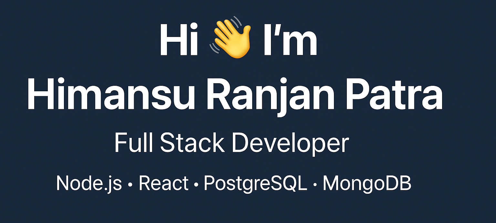

<!---
⭐ Please consider starring the repo if you like this profile README.
-->

---

## 🔗 Connect With Me  

&nbsp;

&nbsp;

&nbsp;

---

## 👨‍💻 About Me
- 🌱 I am Currently working as **Software Engineer at Coforge** (Node.js, Express, React, MySQL, Microservices).  
- 🚀 Building projects with **MERN + PostgreSQL + Prisma**.  
- 🔐 Interested in **system design, performance optimization, AI, and scalable APIs**.  
- 💬 Ask me about **Node.js, React, Databases, or JWT Authentication**.  
- 📫 Reach me at: **patrahimansuranjan@gmail.com**  
- ⚡ Fun fact: Solved **400+ DSA problems** on LeetCode & GFG 🚀  

---

## 🛠️ Languages & Tools

  
  
  
  
  
  
  
  
  
  
  

---

## 🚀 Featured Projects
- [**Organization Management App**](https://github.com/HimansuRanjan/Organisation_Management) — MERN microservices app with role-based access.  
- [**Blogging Platform**](https://github.com/HimansuRanjan/Blog-App) — Full-stack blog with JWT cookie auth, Cloudinary, Prisma + PostgreSQL.  
- [**iNoteBook App**](https://github.com/HimansuRanjan/NoteBook-App) — Secure note-taking MERN app with JWT authentication.  

---

## 🏆 Achievements
- Solved **400+ DSA problems** on LeetCode & GFG.  
- Completed **100xDevs Full Stack Web Development Course**.  
- Completed **Java Programming Masterclass (Java 11 & 17) - Udemy**.  

---

## 📊 GitHub Stats

  

|  |  |
|---|---|

---

<h3 align="center">⭐ Show some love by starring my repositories!</h3>
